# 🚀 ENEM Para Todos | Revolucionando a Preparação para o ENEM com Inteligência Artificial

## 💡 Visão Geral

O **ENEM Para Todos** é uma plataforma revolucionária desenvolvida durante a Imersão IA da Alura, projetada para democratizar o acesso à educação de qualidade e preparação para o ENEM. Utilizando o poder da Inteligência Artificial através do Google Gemini, nossa plataforma oferece uma experiência de estudo personalizada, adaptativa e acessível para todos os estudantes brasileiros.

### 🤖 Implementação da IA: Chatbot e Agentes Gemini

O projeto implementa dois conceitos-chave da tecnologia Gemini:

#### 1. Chatbot Gemini
Implementado no `gemini_service.py`, nosso chatbot permite conversas contextualizadas sobre questões do ENEM:

- **Conversas Contextualizadas**: O sistema mantém o contexto das questões durante toda a interação
- **Histórico de Conversas**: Capacidade de continuar conversas anteriores com todo o histórico preservado
- **Formatação Rica**: Respostas formatadas em HTML para melhor experiência visual
- **Personalização**: Prompts cuidadosamente elaborados para simular um tutor educacional especializado

#### 2. Agentes Gemini
Implementado no `research_service.py`, utilizamos o Google ADK (Agent Development Kit) para criar agentes especializados:

- **Agente de Pesquisa**: Busca informações detalhadas sobre tópicos educacionais usando a ferramenta de pesquisa Google
- **Agente de Criação de Conteúdo**: Transforma resultados de pesquisa em material educacional estruturado
- **Agente de Flashcards**: Gera flashcards de estudo a partir do conteúdo educacional

Esses agentes trabalham em pipeline, onde a saída de um serve como entrada para o próximo, criando um fluxo completo de pesquisa e geração de material de estudo personalizado.

### 🌟 Por que o ENEM Para Todos é revolucionário?

- **Personalização Inteligente**: Simulados e questões geradas por IA adaptadas ao perfil de cada estudante
- **Acessibilidade**: Democratiza o acesso à educação de qualidade para todos os estudantes
- **Feedback Imediato**: Análise detalhada de desempenho e explicações personalizadas
- **Interatividade**: Possibilidade de conversar com a IA sobre qualquer dúvida em questões específicas
- **Recursos Complementares**: Flashcards inteligentes e materiais de estudo personalizados

## 🔍 Funcionalidades Principais

### 📝 Simulados Personalizados
- Geração de simulados no formato ENEM
- Personalização por área de conhecimento ou tópico específico
- Diferentes níveis de dificuldade adaptados ao perfil do estudante
- Temporizador para simular condições reais do exame

### 🤖 Assistente de Estudos com IA
- Chat interativo para tirar dúvidas sobre questões específicas
- Explicações detalhadas sobre cada resposta
- Sugestões de tópicos relacionados para aprofundamento
- Identificação de padrões de erros e recomendações personalizadas

### 📚 Flashcards Inteligentes
- Criação automática de flashcards a partir de questões
- Sistema de repetição espaçada para otimizar a memorização
- Organização por temas e dificuldade
- Acompanhamento de progresso de aprendizado

### 🔎 Pesquisa Inteligente
- Ferramenta de pesquisa avançada para tópicos do ENEM
- Materiais de estudo gerados por IA
- Resumos e explicações adaptados ao nível do estudante

## 🛠️ Tecnologias Utilizadas

### Frontend
- **React**: Biblioteca JavaScript para construção de interfaces
- **TypeScript**: Superset tipado de JavaScript para maior robustez
- **Firebase Authentication**: Autenticação segura de usuários
- **CSS Moderno**: Design responsivo e acessível

### Backend
- **Python**: Linguagem de programação versátil e poderosa
- **Flask**: Framework web leve e flexível
- **Firebase Firestore**: Banco de dados NoSQL escalável
- **Google Gemini API**: Motor de IA para geração de conteúdo educacional
- **JWT**: Autenticação segura via tokens

## 🧠 Inteligência Artificial

O coração do ENEM Para Todos é o Google Gemini, um dos modelos de IA mais avançados disponíveis atualmente. Utilizamos esta tecnologia para:

- **Geração de Questões**: Criação de questões contextualizadas no formato ENEM
- **Explicações Detalhadas**: Análises aprofundadas de cada questão e resposta
- **Conversação Natural**: Interface conversacional para tirar dúvidas
- **Personalização de Conteúdo**: Adaptação do material ao perfil e necessidades do estudante

## 🌱 Impacto Social

O ENEM Para Todos foi concebido com a missão de reduzir a desigualdade educacional no Brasil:

- **Acesso Universal**: Democratização do acesso a materiais de estudo de alta qualidade
- **Personalização para Todos**: Experiência de aprendizado adaptada às necessidades individuais
- **Redução de Barreiras**: Eliminação de obstáculos financeiros e geográficos à educação de qualidade
- **Empoderamento**: Capacitação de estudantes de todas as origens para competir em igualdade de condições

## 🔮 Visão de Futuro

- **Expansão de Conteúdo**: Inclusão de mais disciplinas e tópicos especializados
- **Comunidade de Aprendizado**: Criação de grupos de estudo e colaboração entre estudantes
- **Integração com Escolas**: Parcerias com instituições de ensino para complementar o currículo tradicional
- **Análise Preditiva**: Utilização de dados para prever tendências do ENEM e otimizar a preparação

## 👥 Equipe

O ENEM Para Todos foi desenvolvido por uma equipe apaixonada por educação e tecnologia durante a Imersão IA da Alura, combinando expertise em desenvolvimento de software, educação e inteligência artificial.

## 📱 Interface da Aplicação

Conheça a interface intuitiva e moderna do ENEM Para Todos:

### Tela de Login

### Página Inicial
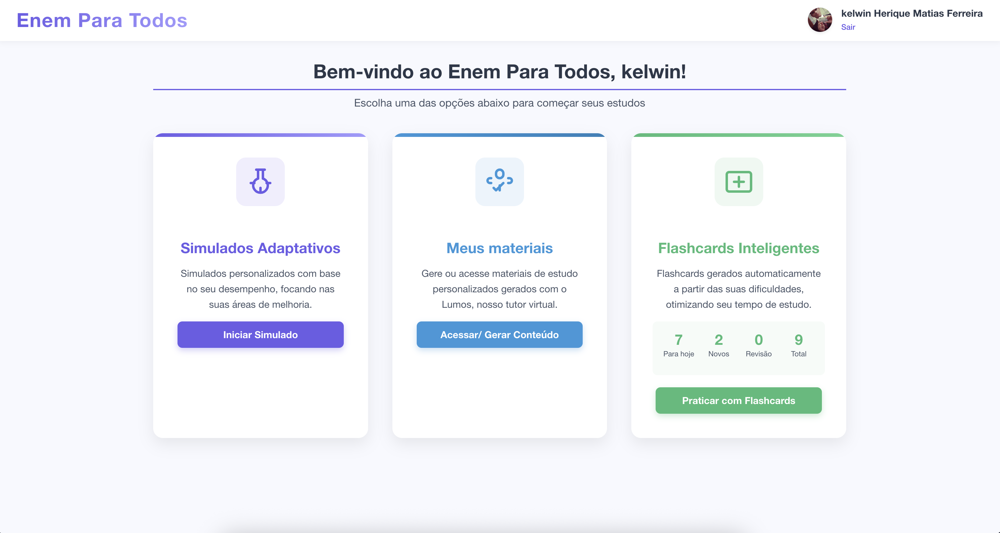

### Configuração de Simulado
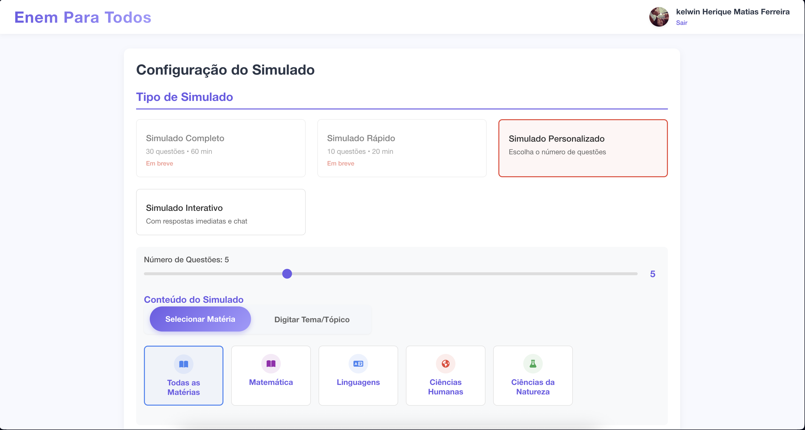

### Questão do Simulado
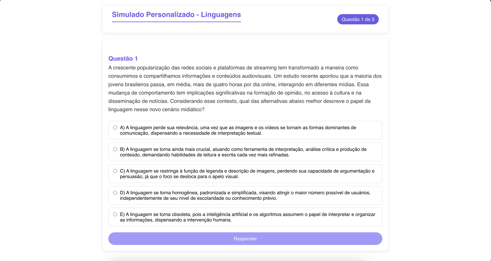

### Resultado do Simulado

### Resposta e Explicação
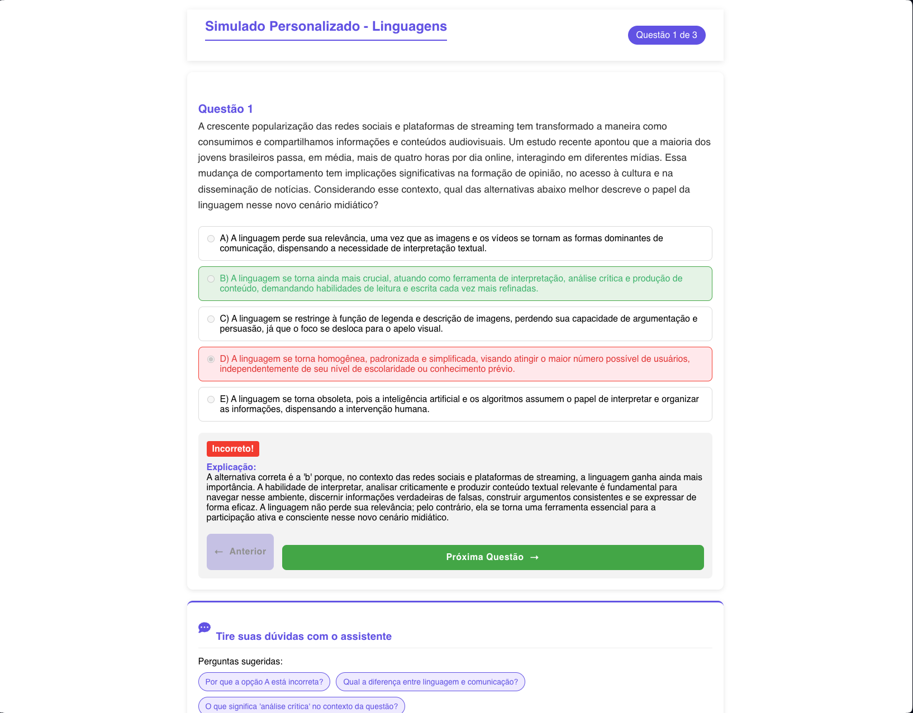

### Lista de Pesquisas
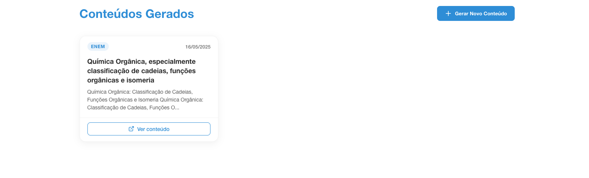

### Criar Nova Pesquisa
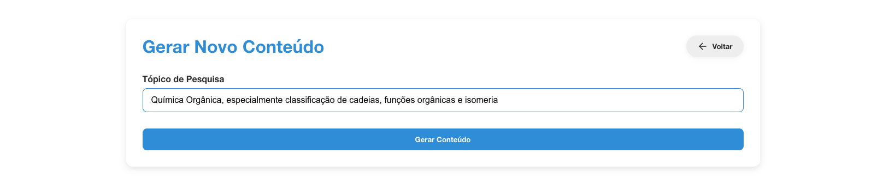

### Converse com o Lumos
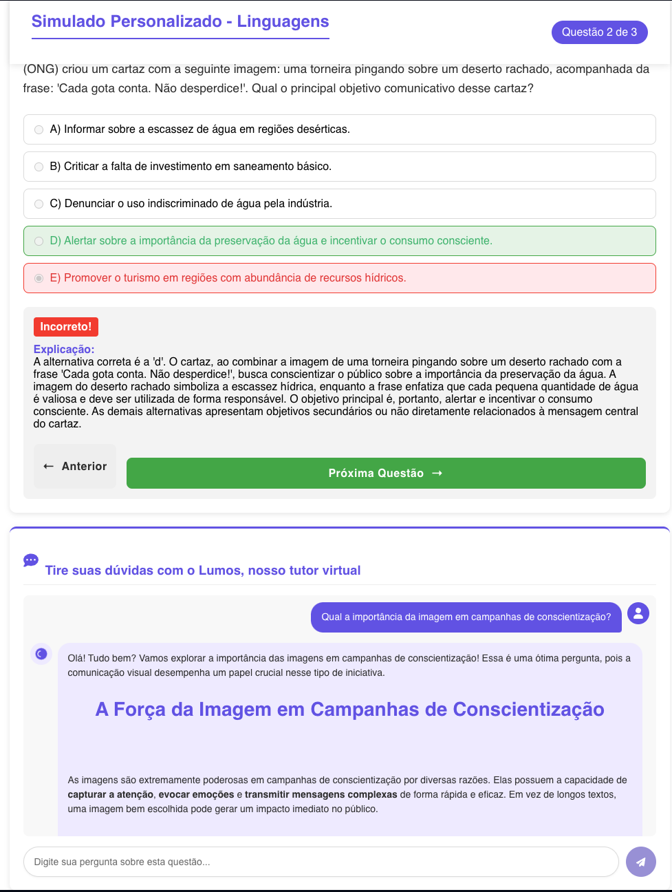

### Detalhes da Pesquisa
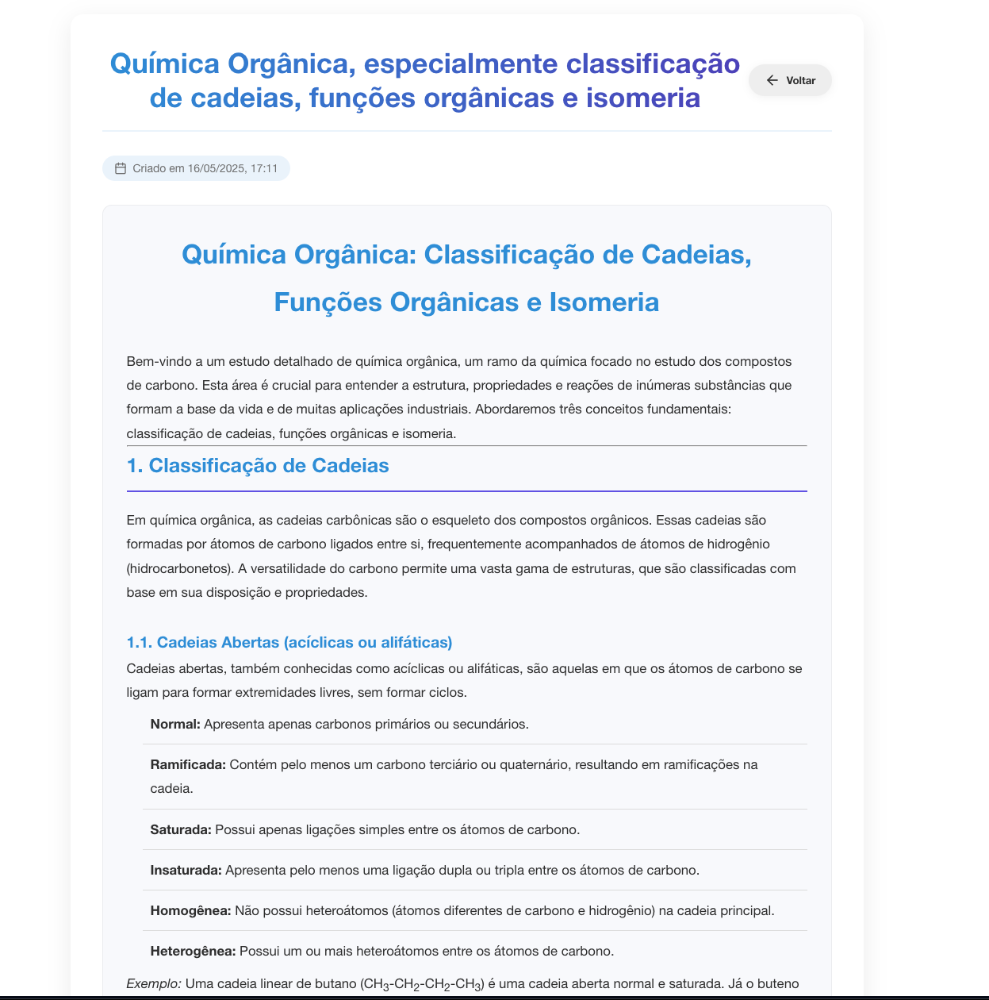

### Flashcards de Estudo
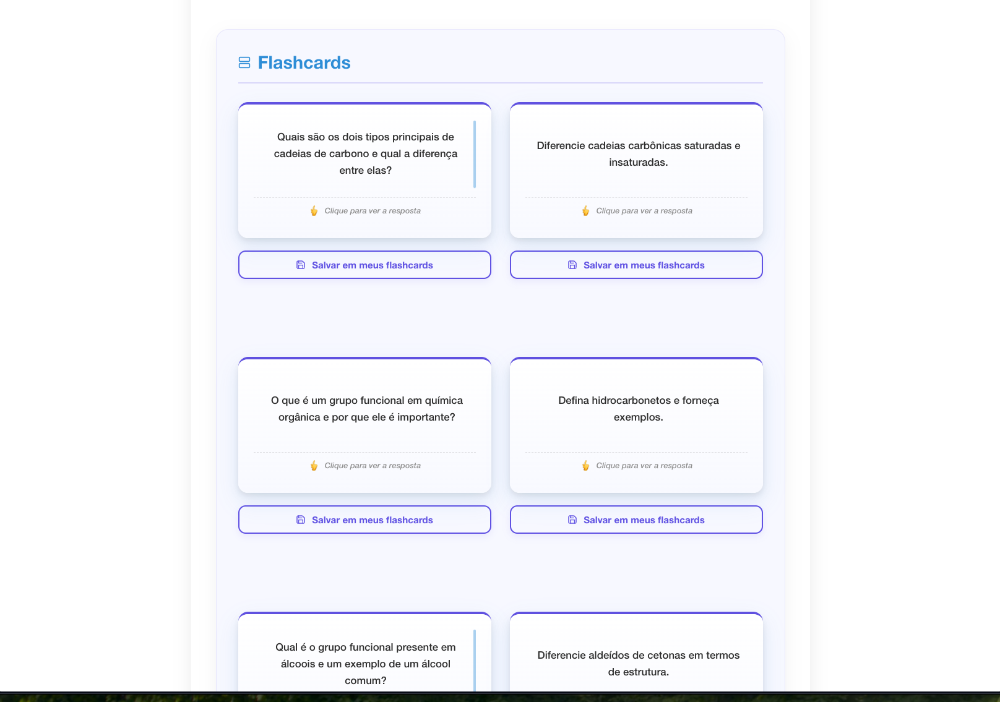

### Frente do Flashcard
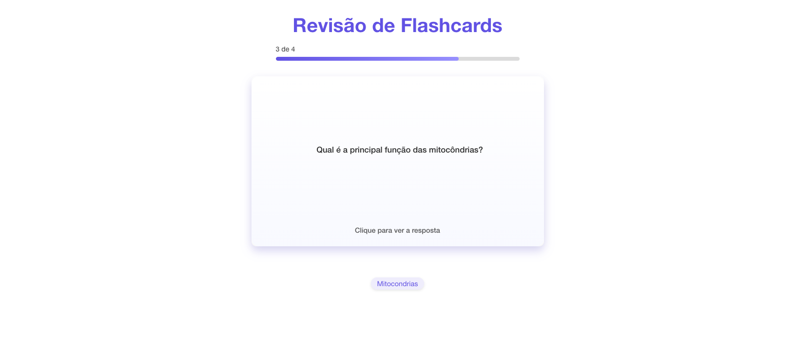

### Verso do Flashcard
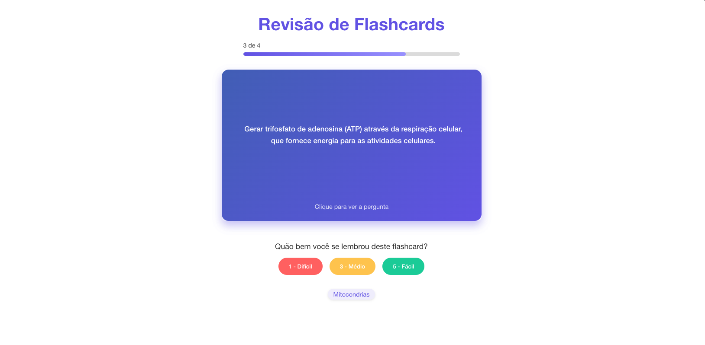

---

**ENEM Para Todos** | *Democratizando o acesso à educação de qualidade através da inteligência artificial*

